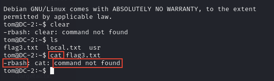

# Escaping Restricted Shell

Good day everyone, been quite some times since I last post anything in this blog. Gonna try be more consistent after this. Wish me luck.

Today I want to share about How to escape restricted shell. But first what is Restricted Shell ?

### Restricted Shell

Basically a way to restrict user from executing command other than what is being allowed. Take example below is using `rbash`. We try to use `clear` and `ls` and even `cat` command but the shell does not even found the command.

<figure><figcaption></figcaption></figure>

Before we continue I need to explain what is `PATH` in linux.

### What is PATH in Linux ?

`PATH` is an environment variable that specifies a list of directories where the system looks for executable files. In easy words, if we were to execute command, for example `ls`, the system will check through all the PATH to see if there's `ls`. If there is, then the command can be executed, but if none, it will prompt `command not found` like images before.

We continue.

To check what command is allowed we can check the `PATH` by using `export -p` to show the environment.

<figure><figcaption></figcaption></figure>

Then we `-ls $PATH`. This show what command that we are allow to execute.

<figure><figcaption></figcaption></figure>

To escape this restriction shell, we can use any of the above command and check on GTFOBins and check if there's function `shell` on the allowed command. Here we can see `vi` does have Shell function.

<figure><figcaption></figcaption></figure>

We can try any of these 2. I tried both but the second one works. We only need to copy all the command and paste it on the restricted shell that we have.

<figure><figcaption></figcaption></figure>

When prompt below, just press enter.

<figure><figcaption></figcaption></figure>

Then we can export the default path for linux, since this is linux box. Then we now have the ability to execute command like normal again since the PATH for the linux is not restricted to only `/home/tom/usr/bin` anymore.

<figure><figcaption></figcaption></figure>

There's other way you can experiment on how to escape restricted shell. You play around this box on [https://portal.offsec.com/labs/play](https://portal.offsec.com/labs/play), Room: DC-2.

Thanks for reading !
