---
categories:
- CTF
- Writeup
date: 2025-09-09
draft: false
description: 
slug: htb-cap-ctf
image: img/cap-logo.png
tags:
- linux
- technical
title: HTB - Cap Writeup
---

# HTB - Cap

<figure>
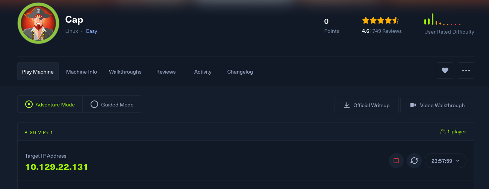
<figcaption aria-hidden="true">HTBCapLogo</figcaption>
</figure>

**Target**: 10.129.22.131

## Enumeration

We began our enumeration with an Nmap scan to identify open ports and services. The scan revealed three open ports: 21 (FTP), 22 (SSH), and 80 (HTTP).

<figure>
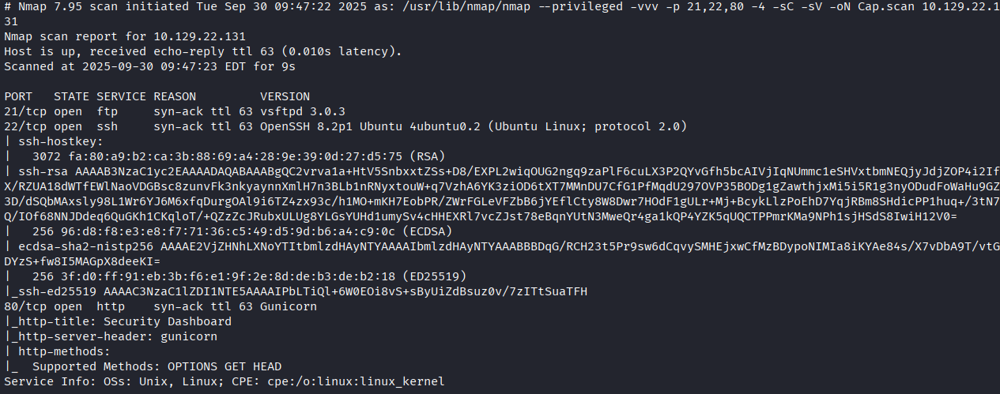
<figcaption aria-hidden="true">NmapScanResults</figcaption>
</figure>

We attempted to log in to the FTP service using anonymous credentials, but the attempt was unsuccessful.

<figure>
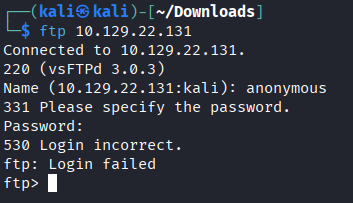
<figcaption aria-hidden="true">FTPAnonymousLoginAttempt</figcaption>
</figure>

Visiting the web server revealed a security dashboard. We don't much also from `IP Config` and `Network Status` tabs

<figure>
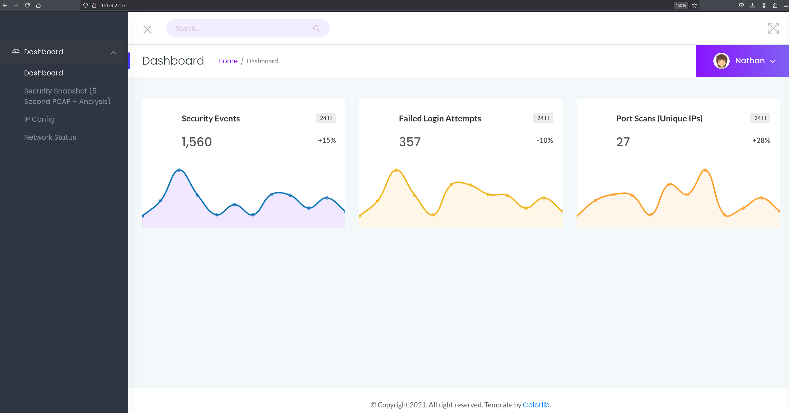
<figcaption aria-hidden="true">WebDashboard</figcaption>
</figure>

<figure>
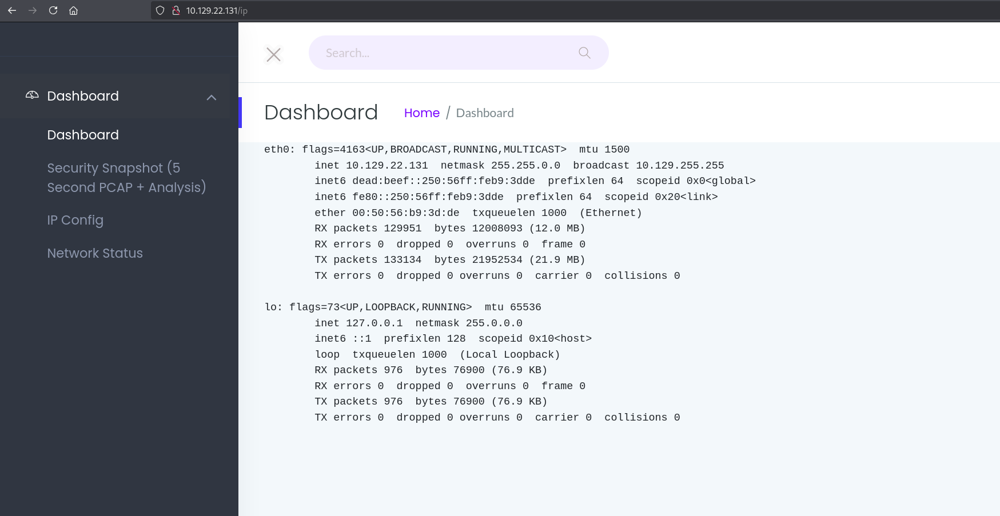
<figcaption aria-hidden="true">WebDashboardPage2</figcaption>
</figure>

<figure>
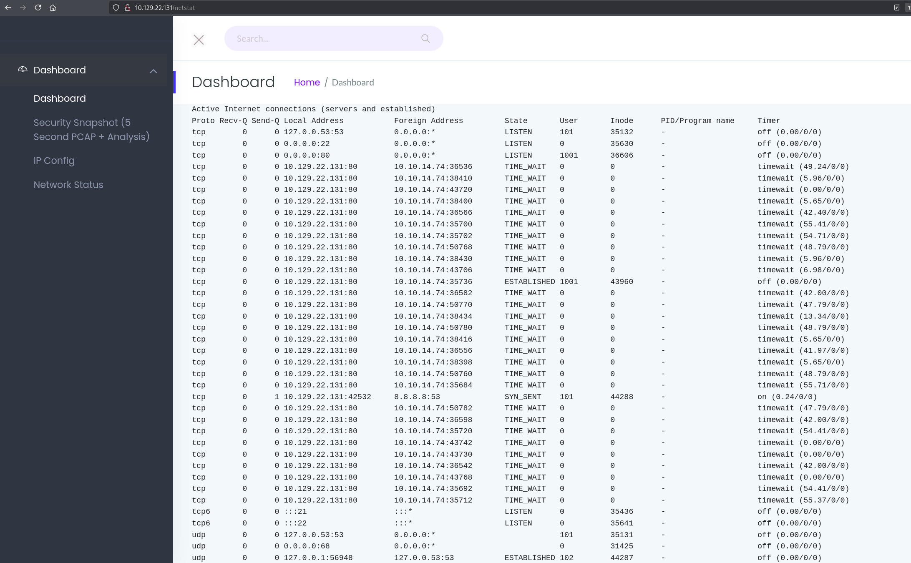
<figcaption aria-hidden="true">WebDashboardPage3</figcaption>
</figure>

We ran `feroxbuster` in the background to enumerate directories and files while manually exploring the web application.

<figure>
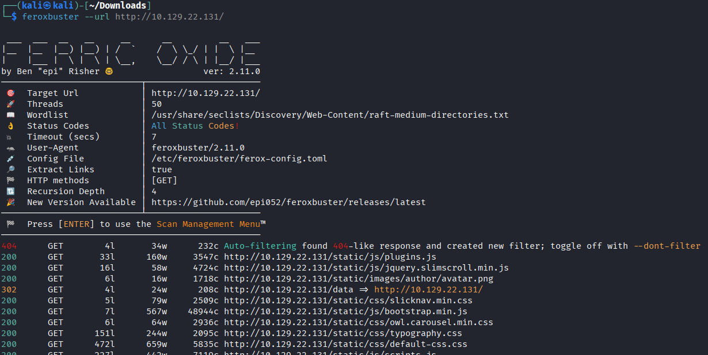
<figcaption aria-hidden="true">FeroxbusterScan</figcaption>
</figure>

While inspecting the navigation bar, we noticed a IDOR Vulnerabilities on `Security Snapshot` link with a URL ending in `/4`. By manipulating the URL (e.g., changing to `/0`), we discovered other downloadable PCAP files.

<figure>
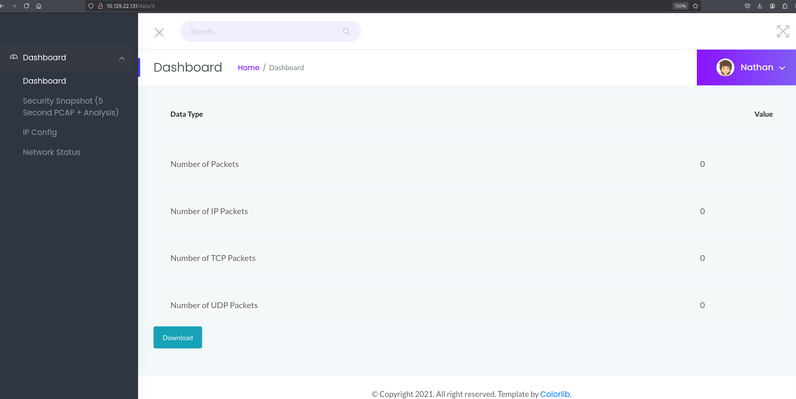
<figcaption aria-hidden="true">PCAPFileDiscovery</figcaption>
</figure>

## Exploitation

### Nathan Credential Discovery

Analyzing the PCAP file we download from `/0` in Wireshark, we identified an FTP login attempt with plaintext credentials.

<figure>
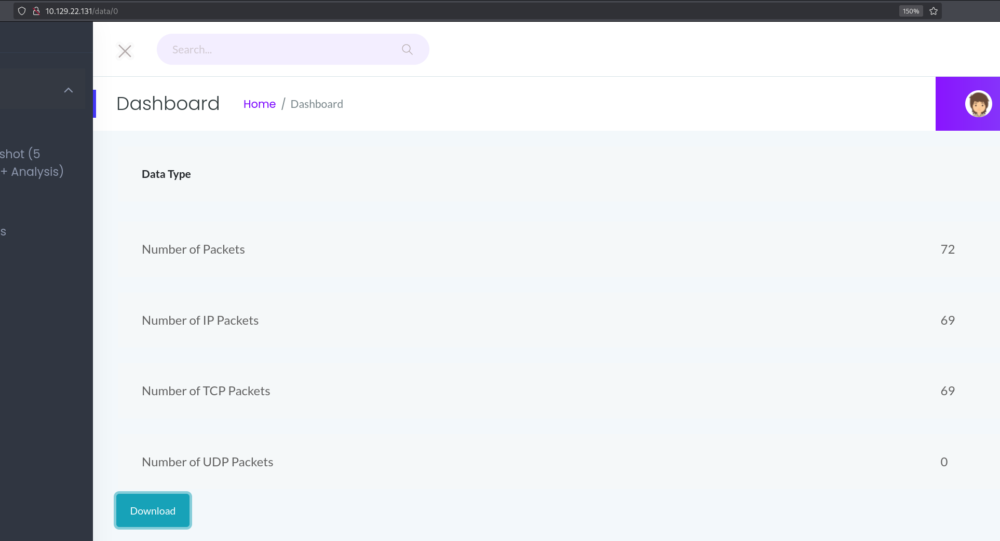
<figcaption aria-hidden="true">PCAPFTPLogin</figcaption>
</figure>

<figure>
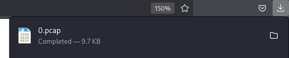
<figcaption aria-hidden="true">PCAPFTPCredentials</figcaption>
</figure>

Following the TCP stream, we extracted the credentials:

- **Username**: nathan
- **Password**: Buck3tH4TF0RM3!

<figure>
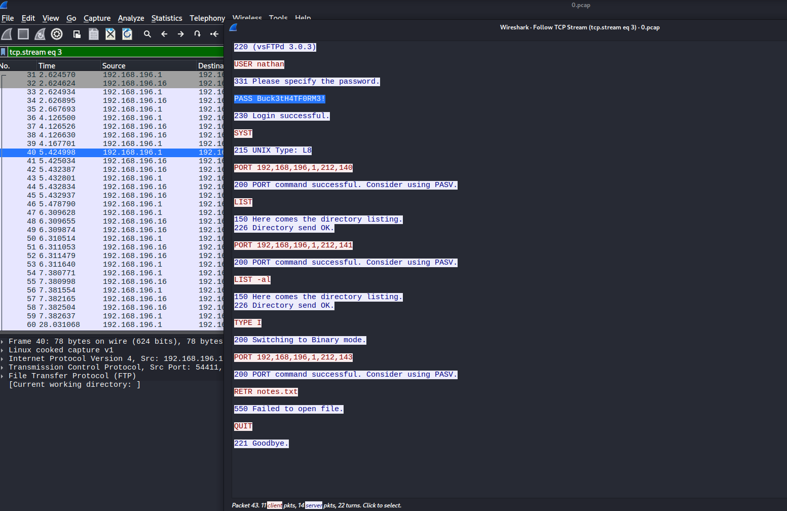
<figcaption aria-hidden="true">PCAP Credential Extraction</figcaption>
</figure>

### Gaining Access

Using the credentials `nathan:Buck3tH4TF0RM3!`, we successfully logged into the FTP service and retrieved the `user.txt` flag.

<figure>
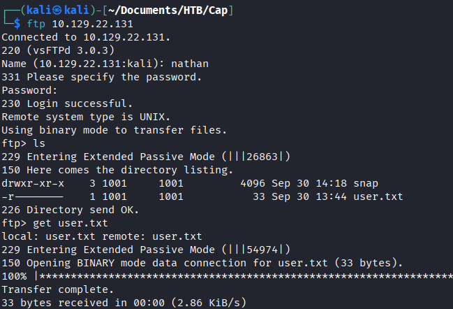
<figcaption aria-hidden="true">FTPLoginSuccess</figcaption>
</figure>

The same credentials also granted access to the system via `SSH`.

<figure>
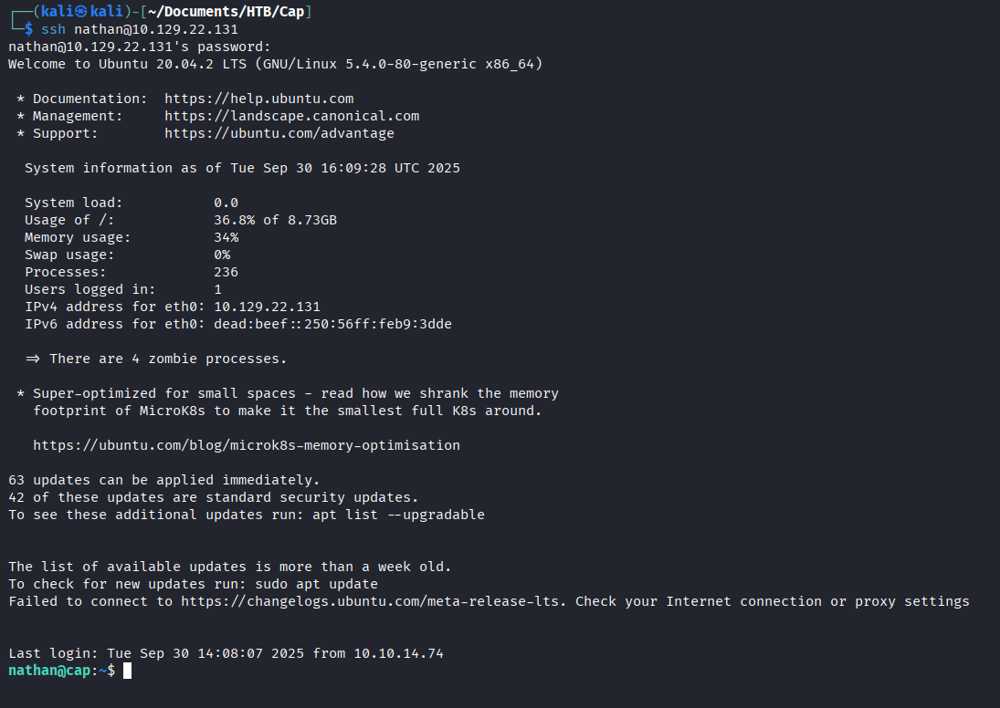
<figcaption aria-hidden="true">SSHLogin</figcaption>
</figure>

## Privilege Escalation

During enumeration on the system, we discovered that `python3.8` had capabilities that could be abused for privilege escalation.

<figure>
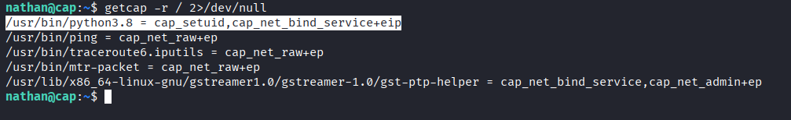
<figcaption aria-hidden="true">SSHLogin</figcaption>
</figure>


\### What is Capabilities in Linux ?

Linux capabilities break down the full privileges of root into smaller, fine-grained permissions (e.g., `CAP_NET_BIND_SERVICE`, `CAP_SETUID`, `CAP_SYS_ADMIN`). Instead of giving a binary full root rights, the system can assign only the capability it needs.

However, if dangerous capabilities are set on interpreters (like Python), they can be abused for privilege escalation. For example, if Python has `CAP_SETUID`, an attacker can change their UID to 0 and spawn a root shell.

You can list file capabilities with:

```bash
getcap -r / 2>/dev/null
```

<figure>
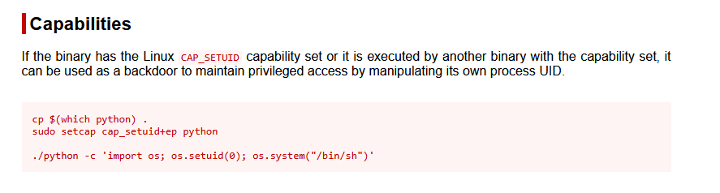
<figcaption aria-hidden="true">PrivilegeEscalationStep2</figcaption>
</figure>

We executed the following command to gain a root shell:

``` bash
python3.8 -c 'import os; os.setuid(0); os.system("/bin/sh")'
```

<figure>
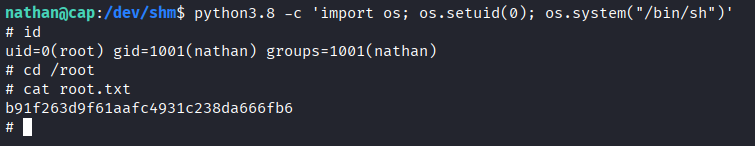
<figcaption aria-hidden="true">RootShell</figcaption>
</figure>

This command leveraged the `setuid` capability to escalate privileges, granting us root access and completing the challenge.

## Loot

### Credentials

- **Username**: nathan
- **Password**: Buck3tH4TF0RM3!

### Flags

- **User Flag**: Retrieved via FTP.
- **Root Flag**: Obtained after privilege escalation.
